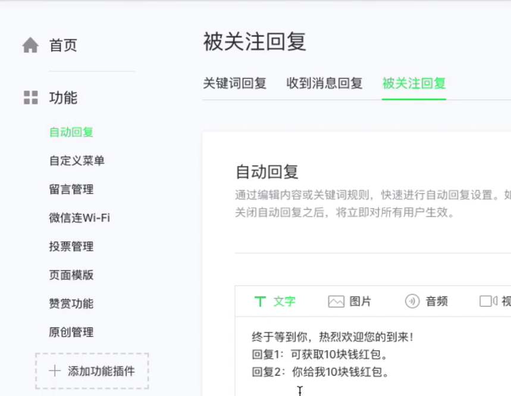

新浪云sae创建nodejs容器应用 通过git把服务端代码push 到新浪云

# 

# 1.微信公众号介绍

## 1.1.公众号类型 及基本介绍

* 服务号,订阅号,小程序之间的关联和区别


## 1.2.编辑模式的使用

非开发者使用微信公众号的方式,通过微信公众号提供的平台来编辑

### 1.自动回复：




### 2.自定义菜单


### 3.多媒体素材管理

可以上传图片，音频，视频

### 4.图文素材

可以发布图文文章

### 5.话题标签→页面模板

新建一个页面模板，然后在自定义菜单里做关联

### 6.开发模式及预备知识介绍

如果我们不想使用默认的编辑模式,可以在具备一些预备知识的前提下,以开发模式更加灵活地进行公众号的开发.

 


# 2.认识服务器

## 2.3.Nodejs服务端开发

### 2.3.1.Express

基于Node.js平台,快速,开放,极简的web开发框架.

* 第二章下面新建文件夹：01，express

* 文件夹下新建Express.md

  * 一。搭建一个Express开发目录

  * ```
    npm install -g express-generator
    ```

     安装express生成器

  * ```
    express -h
    ```

    观察有哪些命令选项

  * ```
    express --no-view my-server
    ```

     

    * 当前文件夹下自动生成一个my-server文件夹

  * ```
    cd my-server
    ```

    进入这个新生成的文件夹

  * ```
    npm i 
    ```

    执行安装依赖包

  * ```
    npm run start
    ```

     启动项目

  * 浏览器地址栏输入：https://localhost:3000 访问express项目

* Express项目目录介绍

  * bin/www:项目启动文件
  * mode_modules:第三方包存放的文件夹
  * public静态资源存放的目录
  * routes路由文件
    * req.body:接受前端post提交的数据
  * app.js项目相关的依赖文件，路由整合等

### 2.3.2.MongoDB

MongoDB基于分布式文件存储的数据库.

* 下载并安装mongodb数据库环境

* ```
  mongod
  ```

   启动服务，windows版本安装后自动启动

* 下载mongodb compass或者Robo3T可视化管理工具

* 通过可视化管理工具连接已经启动的mongodb数据库

* 使用mongoose模块，实现express服务与mongodb数据库的连接等操作

### 2.3.3.Mongoose

mongoose是对mongodb进行便捷操作的对象模型工具.

* ```
  npm i mongoose
  ```

   安装

* 项目根目录新建文件夹db，里面创建connect.js文件:

  * ```shell
    const mongoose = require('mongoose')
    
    mongoose.connect('mongodb://127.0.0.1:27017/weixin', (err) => {
      if(err){
        console.log('数据库连接失败');
      }else{
        console.log('数据库连接成功');
      }
    })
    ```

* app.js添加:

  * ```shell
    var db = require('./db/connect')
    ```

* 重新启动项目,查看控制台输出

* 查询mongoose官网说明文档

* db下新建models文件夹,里面新建UserModel.js文件

  * ```shell
    var mongoose = require('mongoose')
    
    var userSchema = new mongoose.Schema({ // 表结构对象
      user:String,
      pwd:String
    })
    
    var UserModel = mongoose.model('userModel', userSchema) // 操作表结构对象的数据模型
    
    module.exports = UserModel
    ```

* routes/index.js文件添加内容:

  * ```shell
    var UserModel = require('../db/models/UserModel')
    router.post('/reg', function(req, res) {
      console.log(req.body);
      let {user, pwd} = req.body;
      // 使用mongoose提供的方法，将user和pwd存储至数据库
      new UserModel({ // 一条具体的数据
        user: user,
        pwd: pwd
      }).save().then(() => {
        res.send({code: 1, msg: '注册成功'})
      })
    })
    ```

* 重启项目

* postman向服务器发起请求:http://localhost:3000/reg

* mongodb可视化工具查看插入结果

### 2.3.4.Robo3T或mongodb compass

Robo3T或mongodb compass是mongodb的一个非常好用的可视化管理工具.

### 2.3.5.在线部署

云服务器,应用容器,新浪云SAE,Git代码托管及部署.

* 打开新浪云网站,注册并登录
* 控制台→云应用SAE
* 点击:创建应用
  * 开发语言选:**NodeJS**
  * 运行环境:**容器环境**
  * 语言版本:**自定义**
  * 代码管理方式:**Git**
  * 单实例配置:**基础性**
  * 实例个数:**1**
  * 二级域名:自定义
  * 应用名称:**微信公众号开发**
* 运行环境管理→代码管理→Git仓库管理
* 第二章目录下打开终端
* 输入git clone命令,当前目录下会生成一个新的目录
* my-server下的所有目录和文件拷贝到新生成的目录下
* git提交
  * git add .
  * git commit -m '服务器基础代码'
  * git push
* 返回新浪云控制台:在"应用信息"里找到新建应用时分配的二级域名,点击这个域名,后面添加/auth,测试

## 2.4.微信公众号开发鉴权

* 1.网页授权流程
* 2.JS-SDK介绍及鉴权
* 3.域名的申请与绑定
* 4.config接口注入权限验证配置
* 5.通过ready接口处理成功验证
* 6.JS-SDK常用功能演示
* 7.分享微信好友及朋友圈
* 8.图片选取与上传功能
* 9.音频接口实现留言
* 10.地理位置获取

# 3.js-sdk

## 3-1 js-sdk鉴权流程


## 3-2 公众号js安全域名设置

微信公众平台后台→公众号设置→功能设置→js接口安全域名  

### 步骤一：绑定域名

* 1.微信公众平台进入“**公众设置**”的“**功能设置**”里填写“**js接口安全域名**”。

> 需要实现下载一个MP_verify_CkkLkOrI8NqpLutd.txt文件，放在我们自己填写的域名的静态资源文件夹下去 
> 保证我们可以通过域名路径+MP_verify_CkkLkOrI8NqpLutd.txt的方式可以访问到该文件，已做验证
> 例如：我们想要配置happister.saelinzi.com 域名
> 则我们要保证通过happister.saelinzi.com/MP_verify_CkkLkOrI8NqpLutd.txt 可以访问到服务器上的这个文件

* 2.**IP白名单配置**

> 微信公众平台进入“安全中心”的“IP白名单”里填写，跟js-sdk鉴权相关的所有ip
> 新浪云相关ip的位置：文档中心----入口与出口ip----外网访问出口 ip 列表 :所有的ip拷贝到微信公众号ip白名单里去

### 步骤二：引入JS文件

> 在需要调用js接口的页面引入如下js文件，（支持https）：http://res.wx.qq.com/open/js/jweixin-1.6.0.js

### 步骤三：通过config接口注入权限验证配置

> 所有需要使用js-sdk的页面必须先注入配置信息，否则将无法调用
> 配置项代码如下：

```
wx.config({
  debug: true, // 开启调试模式，调用的所有api的返回值会在客户端alert出来，若要查看传入的参数，可以在pc端打开，参数信息会通过log打出，仅在pc端时才会打印。
  appId: '自己公众号的APPID', // 必填，公众号的唯一标识
  timestamp: '自己在服务端写一个方法函数生成', // 必填，生成签名的时间戳
  nonceStr: '自己在服务端写一个方法函数生成', // 必填，生成,生成签名的随机串
  signature: '需要跟微信服务器对接', // 必填，签名
  jsApiList: [
    'chooseImage',
    'openLocation',
    'getLocation'
  ] // 必填，需要使用的js接口列表
})
```

### 步骤四:引入axios文件

```shell
<script src="https://cdn.bootcss.com/axios/0.19.2/axios.min.js"></script>
```

### 步骤五:config代码外层包上一层:

```shell
axios.get('/jsapi',{
 url:encodeURIComponent(location.href.split('#')[0])
}).then(result=>{
	wx.config({
		...
	})
})
```


## 3-3 公众号服务器接入

* 微信公众平台后台→基本配置→服务器配置

  * 第一步，填写服务器配置

    * URL:***/auth
    * Token:比如填写testweixin
    * EncodingAESKey
    * 消息加解密方式

  * 第二步，验证消息的确来自微信服务器

    * 开发者提交信息后，微信服务器发送GET请求到填写的服务器地址URL上，GET请求携带参数如下表所示：

      * | 参数      | 描述                                                         |
        | --------- | ------------------------------------------------------------ |
        | signature | 微信加密签名，signature结合了开发者填写的token参数和请求中的timestamp参数、nonce参数。 |
        | timestamp | 时间戳                                                       |
        | nonce     | 随机数                                                       |
        | echostr   | 随机字符串                                                   |

      * ```shell
        nodejs验证代码实现:
        router.get('/auth', function(req, res) {
          let { signature, timestamp, nonce, echostr } = req.query;
          let token = 'testweixin';
          let array = [timestamp, nonce, token];
          array.sort(); // 字典排序
          let str = array.join('');
          let resultStr = sha1(str); // 对字符串进行sha1加密,npm i sha1
          if(resultStr == signature){
            res.set('Content-type', 'text/plain')
            res.send(echostr);
          }else{
            res.send('Error!!!!!')
          }
        })
        ```

      * 修改完代码后提交服务器

  * 第三步，依据接口文档实现业务逻辑

## 3-4 获取鉴权接口所需的jsapi_ticket


* 微信开放文档→微信网页开发→JS-SDK说明文档→1.1.3 步骤三:通过config接口注入权限验证配置→附录1→jsapi_ticket→access_token→https://developers.weixin.qq.com/doc/offiaccount/Basic_Information/Get_access_token.html→获取access_token接口: https://api.weixin.qq.com/cgi-bin/token?grant_type=client_credential&appid=APPID&secret=APPSECRET
* 通过这个接口获取jsapi_ticket:https://api.weixin.qq.com/cgi-bin/ticket/getticket?access_token=ACCESS_TOKEN&type=jsapi

## 3-5 获取鉴权接口所需的signature签名信息

```shell
# config/index.js文件
module.exports = {
  appid: '***',
  secret: '***'
}
```

```shell
# utils/sign.js文件
let {appid, secret} = require('../config')
let axios = require('axios')
let sha1 = require('sha1') # npm i sha1

async function getTicket() { // 获取ticket的方法函数
  let tokenUrl = `https://api.weixin.qq.com/cgi-bin/token?grant_type=client_credential&appid=${appid}&secret=${secret}`
  let token_data = await axios.get(tokenUrl)
  console.log('token_data', token_data.data);
  let access_token = token_data.data.access_token // 得到access_token

  let ticketUrl = `https://api.weixin.qq.com/cgi-bin/ticket/getticket?access_token=${access_token}&type=jsapi`
  let ticket_data = await axios.get(ticketUrl) // 得到jsapi_ticket
  console.log('ticket', ticket_data.data);
  return ticket_data.data.ticket
}

let createNonceStr = function(){
  return Math.random().toString(36).substr(2,15)
}

let createTimestamp =  function(){
  return parseInt(new Date().getTime() / 1000) + ''
}

let sign = async function(url) {
  
  let jsapi_ticket = await getTicket()
  
  let obj = {
    jsapi_ticket,
    noncestr: createNonceStr(),
    timestamp: createTimestamp(),
    url
  }

  /* 
  1.参与签名的字段包括noncestr（随机字符串）, 有效的jsapi_ticket, timestamp（时间戳）, url（当前网页的URL，不包含#及其后面部分） 。
  2.对所有待签名参数按照字段名的ASCII 码从小到大排序（字典序）后，
  3.使用URL键值对的格式（即key1=value1&key2=value2…）拼接成字符串string1。这里需要注意的是所有参数名均为小写字符。
  4.对string1作sha1加密，字段名和字段值都采用原始值，不进行URL 转义。 
  */
  let str = row(obj)
  let signature = sha1(str) // 生成签名
  obj.signature = signature
  return obj
}
let row = function(obj) {
  let keys =  Object.keys(obj)
  keys = keys.sort() // 字典排序
  let newObj = {}
  keys.forEach((key)=>{
    newObj[key] = obj[key]
  })
  let string = ''
  for(let k in newObj){
    string += '&' + k +'=' + newObj[k]
  }
  string = string.substr(1)
  return string
}

module.exports = sign

```

```shell
# routes/index.js路由文件
let sign = require('../utils/sign')

router.get('/jsapi', async function(req, res) {
  let url = decodeURIComponent(req.query.url)
  let conf = await sign(url)
  console.log('conf',conf);
  res.send(conf)
})

router.get('/', function(req, res, next) {
  res.render('index', { title: 'Express' });
});
```

```shell
# public/index.html文件:
<html>

<head>
  <title>Express</title>
  <link rel="stylesheet" href="/stylesheets/style.css">
  <script src="http://res.wx.qq.com/open/js/jweixin-1.6.0.js"></script>
  <script src="https://cdn.bootcss.com/axios/0.19.2/axios.min.js"></script>
</head>

<body>
  <h1>Express</h1>
  <p>Welcome to Express</p>
</body>
<script>
  let url = encodeURIComponent(location.href.split('#')[0])
  axios.get('http://localhost:3000/jsapi?url='+url).then((result) => {
    wx.config({
      debug: true,
      appId: '',
      timestamp: '',
      nonceStr: '',
      signature: '',
      jsApiList: []
    })
  })
</script>
</html>
```

## 3-6 完善jsapi鉴权接口并进行本地测试

* 浏览器输入:http://localhost:3000 浏览返回信息

## 3-7 鉴权接口在线部署并使用微信开发者工具进行测试

*  public/index.html文件改写添加vue内容:

```shell
# public/index.html文件改写添加vue内容:
<html>

<head>
  <title>Express</title>
  <link rel="stylesheet" href="/stylesheets/style.css">
  <script src="http://res.wx.qq.com/open/js/jweixin-1.6.0.js"></script>
  <script src="https://cdn.bootcss.com/axios/0.19.2/axios.min.js"></script>
  <script src="https://cdn.bootcss.com/vue/2.6.11/vue.min.js"></script>
</head>

<body>
  <div id="app">
    <h1>Express</h1>
    <p @click="scanCode">扫描二维码</p>
  </div>
</body>
<script>
  

  new Vue({
    el: '#app',
    mounted() {
      this.wxconfig()
    },
    methods: {
      wxconfig() {
        let url = encodeURIComponent(location.href.split('#')[0])
        axios.get('http://localhost:3000/jsapi?url='+url).then((result) => {
          let {appid, timestamp, noncestr, signature} =  result.data
          console.log(result.data);
          wx.config({
            debug: true,
            appId: appid,
            timestamp,
            nonceStr: noncestr,
            signature,
            jsApiList: [
              'scanQRCode'
            ]
          })
        })
      },
      scanCode(){
        wx.scanQRCode({
          needResult: 0, // 默认为0，扫描结果由微信处理，1则直接返回扫描结果，
          scanType: ["qrCode","barCode"], // 可以指定扫二维码还是一维码，默认二者都有
          success: function (res) {
            var result = res.resultStr; // 当needResult 为 1 时，扫码返回的结果
            console.log(result);
          }
        });
      }
    }
  })
</script>
</html>

```

* git push到新浪云服务器

```shell
git add .
git commit -m 'jsapi在线部署'
git push
```

* 打开微信开发者工具,地址栏输入网址

## 3-8 js-sdk鉴权报错排查技巧

* sign.js文件sign函数返回的obj追加一个appid属性

## 3-9 云端数据库启动和连接

* ssh工具登录百度云服务器
* 进入usr/mongodb/
* vim mongodb.conf 查看两个项目
  * port=27017 #端口
  * dbpath= /usr/mongodb/db #数据库文件存放路径
* 本地使用mongodb compass工具连接远程mongodb
* config/index.js文件添加一个配置项mongoip:

```shell
module.exports = {
  appid: 'wx49e3f4174c4e6925',
  secret: '2f71cc3e247d5e7dea6254a6ccc5a735',
  mongoip: '180.76.112.176:27017'
}
```

* db/connect.js文件引入mongoip

```shell
const mongoose = require('mongoose')
const {mongoip} = require('../config')

mongoose.connect(`mongodb://${mongoip}/weixin`, (err) => {
  if(err){
    console.log('数据库连接失败');
  }else{
    console.log('数据库连接成功');
  }
})
```

## 3-10 在云数据库中缓存access_token与jsapi_ticket

* db/models目录新建文件ticketModel.js内容如下:

```shell
var mongoose = require('mongoose')

var ticketSchema = new mongoose.Schema({ // 表结构对象
  access_token:String,
  token_time:String, //存储token的时间点
  ticket:String,
  ticket_time:String //存储ticket的事件点
})

var ticketModel = mongoose.model('ticketModel', ticketSchema) // 操作表结构对象的数据模型

module.exports = ticketModel
```

* 改写utils/sign.js文件部分内容:

```shell
# 添加导入ticketModel.js文件
let ticketModel require('../utils/sign')

# 改写getTicket()函数
async function getTicket() { // 获取ticket的方法函数

  let tik_data = await ticketModel.find();
  let access_token = '';
  let ticket = '';
  if(tik_data.length>0){ // 判断数据库是否存储过ticket
  	let t = new Date().getTime() - tik_data[0].token_time;
  	if(t>7000000){ // 是否过期
  		// 重新获取
      await loadData();
      let {_id} = tik_data[0];
      let time = new Date().getTime();
      await ticketModel.update({_id}, { // 更新数据库中已过期的access_token
        access_token,
        token_time:time,
        ticket,
        ticket_time:time
      })
  	}else{
  		access_token = tik_data[0].access_token;
		  ticket = tik_data[0].ticket;
  	}
  }else{
  	//重新获取
    await loadData();
    let time = new Date().getTime();
    await new ticketModel({ //如果是第一次获取access_token，则对数据库进行新增操作
      access_token,
      token_time:time,
      ticket,
      ticket_time:time
    }).save()
  }
  async function loadData(){
    let tokenUrl = `https://api.weixin.qq.com/cgi-bin/token?grant_type=client_credential&appid=${appid}&secret=${secret}`
    let token_data = await axios.get(tokenUrl)
    // console.log('token_data', token_data.data);
    access_token = token_data.data.access_token // 得到access_token
  
    let ticketUrl = `https://api.weixin.qq.com/cgi-bin/ticket/getticket?access_token=${access_token}&type=jsapi`
    let ticket_data = await axios.get(ticketUrl) // 得到jsapi_ticket
    
    ticket =  ticket_data.data.ticket
  }

  return ticket
}


```

## 3-11 测试access_token缓存结果并部署

* 浏览器输入http://localhost:3000
* 查看浏览器控制台输出结果
* 查看编辑器cmd控制台输出结果
* 查看mongodb compass中存储的token和ticket是否正确

# 4.vue项目集成微信jssdk


* 项目根目录cmd下执行:

  * ```shell
    npm install weixin-js-sdk
    ```

  * 

* 项目下新建src/wx/wxconfig.js,内容如下:

```javascript
import axios from 'axios'
import wx from 'weixin-js-sdk'
async wxconfig() {
    let url = encodeURIComponent(window.location.href.split('#')[0])
    await axios.get('/jsapi?url='+url).then((result) => {
        let {appid, timestamp, noncestr, signature} =  result.data
        console.log('jsapi接口下发的数据',result.data);
        wx.config({
            debug: true,
            appId: appid,
            timestamp,
            nonceStr: noncestr,
            signature,
            jsApiList: [
                'scanQRCode'
            ]
        })
    })
}
export default wxconfig
```

* src/App.vue文件

  * ```shell
    #引入wxconfig
    import wxconfig from './wx/wxconfig'
    
    ```

  * ```shell
    mouted生命周期函数:
    async mounted() {
    	await wxconfig()
    }
    ```

* src/main.js里添加如下代码:

  * ```shell
    import wx from 'weixin-js-sdk'
    Vue.prototype.$wx = wx;
    ```

  * 

* 我的心愿清单页面src/views/Wish.vue

  * ```shell
    # 按钮标签添加添加点击事件
    
    
    #methods里面添加调取二维码的方法:
    scanCode(){
        this.$wx.scanQRCode({
            needResult: 0, // 默认为0，扫描结果由微信处理，1则直接返回扫描结果，
            scanType: ["qrCode","barCode"], // 可以指定扫二维码还是一维码，默认二者都有
            success: function (res) {
                var result = res.resultStr; // 当needResult 为 1 时，扫码返回的结果
                console.log(result);
            }
        });
    }
    ```

* vue.config.js文件配置publicPath:

  * ```shell
    module.exports = {
    	publicPath: './'
    }
    ```

  * 

* npm run build 编译项目生成dist目录

* 将dist

# git不常用命令合集

* 查看git远程仓库地址：git remote -v
* 删除目录或文件的版本控制并保留本地文件或目录：git rm --cache 目录或文件名
* 删除目录或文件的版本控制并连带删除本地文件或目录里：git rm 目录或文件名

# 小知识补充

* Math.random() 生成0到1之间小数后16位的小数
* .toString(36):转换成36进制字符,就是0-9a-z之间的字符

